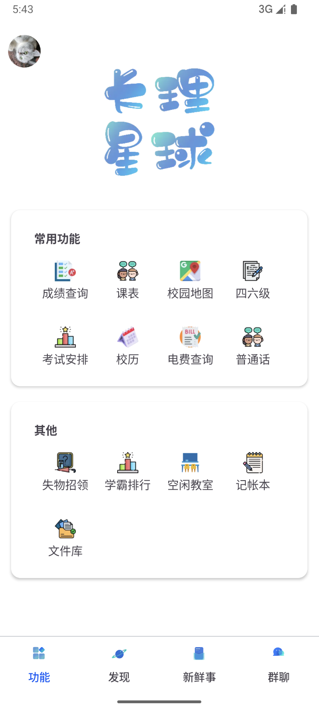
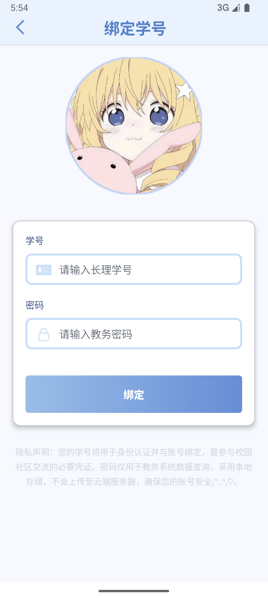
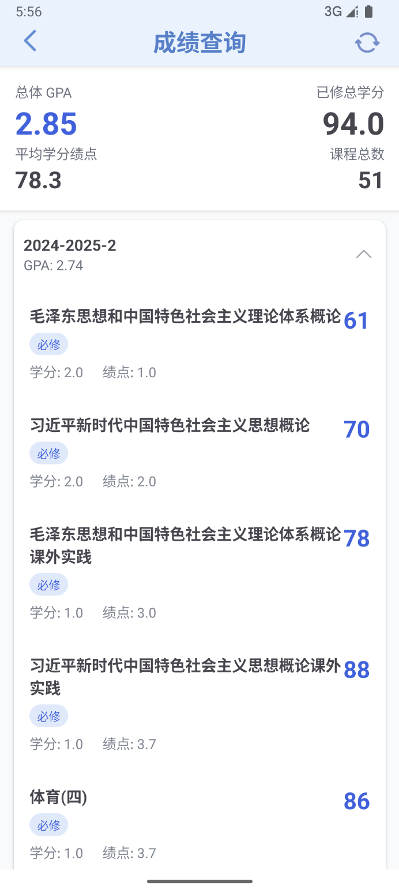
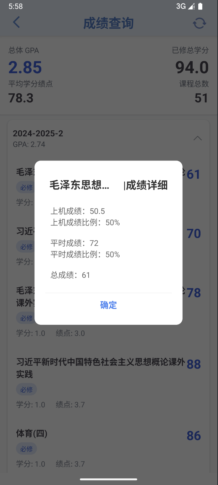
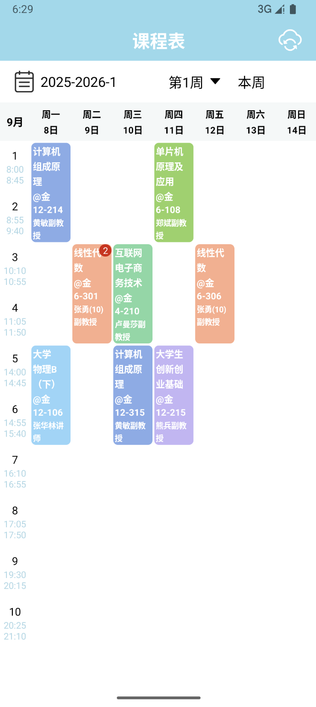
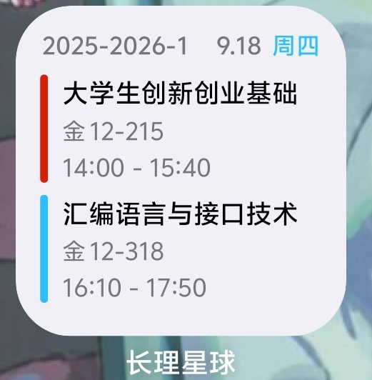

掌上长理是一款面向长沙理工大学师生的轻量化校园工具 App，提供课表、成绩、考试安排、网络课程、宿舍电量和校园服务等功能。

## 主要功能

### 功能页面

- 绑定教务系统后，可使用教务系统相关功能，例如查询课表，成绩或考试安排
- 在不登录的情况下，也可以进行空闲教室，电费查询等功能

|  |  |
| :----------------------------------------------------------: | :----------------------------------------------------------: |

### 成绩查询

> 数据由教务系统提供，此类数据都只会保存在本地，不会上传云端

|  |  |
| :----------------------------------------------------------: | :----------------------------------------------------------: |

### 课表查询

> 进入课表可以查看最新课表，自动存储到本地，定时刷新，在没有网络的环境下也能查看数据~

|  |  |
| :----------------------------------------------------------: | :----------------------------------------------------------: |

### 考试安排

> 在教务系统颁布考试时间后便可查看

### 其他功能

> 可自行探索

## 下载

掌上长理目前提供 Android 版本。

通常建议使用稳定版本. 如果你愿意参与测试并拥有一定的对 bug 的处理能力, 也欢迎使用测试版本更快体验新功能.
具体版本类型可查看下方.

## 参与开发

掌上长理欢迎开发者参与客户端、服务端、产品与视觉设计工作。

欢迎你提交 PR 参与开发，
有关项目技术细节请参考 [CONTRIBUTING](docs/contribution/分支规范.md)

## 友链

[计算机学院往年考试题仓库](https://github.com/MedivhTirisfal/csust_test_database)

## FAQ

### 在掌上长理中输入自己的学生账号与密码是否有泄露的风险

学号和密码仅用于访问相应校园系统，敏感凭据保存在本地。请妥善保管设备与账号，并以学校官方渠道发布的信息为准。

### 如何加入

请通过项目仓库提交 Pull Request 参与开发。

